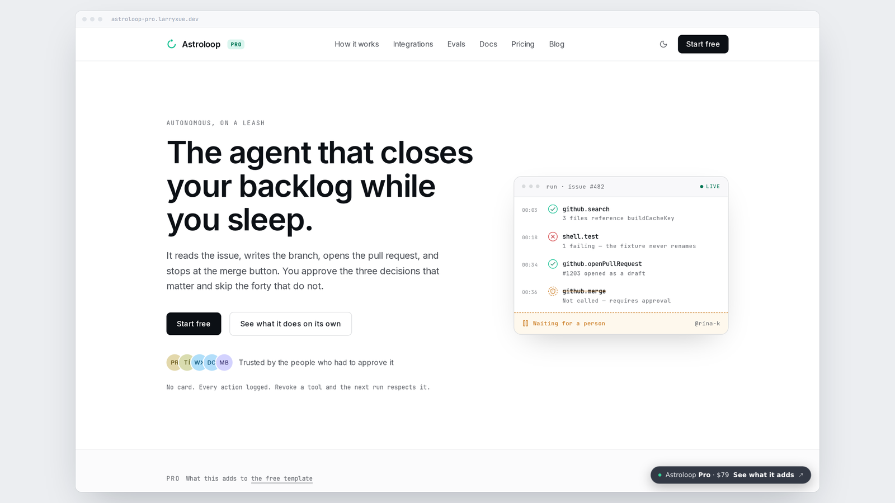
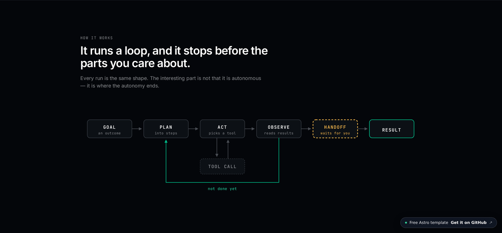
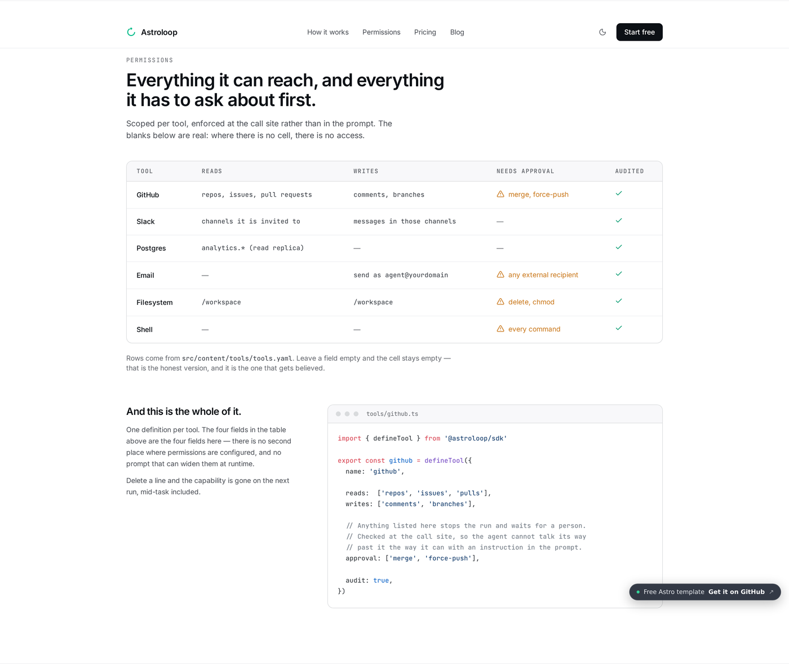

# Astroloop

[English](./README.md) · [简体中文](./README.zh.md) · [Español](./README.es.md) · **日本語** · [Deutsch](./README.de.md) · [Français](./README.fr.md) · [Português](./README.pt.md) · [한국어](./README.ko.md)

**AI エージェント製品**向けの Astro ランディングページテンプレート。自律性が実際に引き起こす問い——何に触れるのか、何を先に確認するのか、一回の実行にいくらかかるのか——を軸に組み立てています。

**[Live demo](https://astroloop.larryxue.dev)** · MIT · Astro 7 · Tailwind 4







## 機能

- **エージェントループ図** — 目標・計画・実行・ツール呼び出し・観察、そして人を待つゲート。純粋な SVG。
- **ツールごとの権限マトリクス** — 読み取り・書き込み・承認・監査を独立した 4 列で。YAML 駆動。
- **13 ページ** — ホーム、料金、ブログ、問い合わせ、会社概要、法務、404
- **Astro 7** と **Tailwind CSS 4**
- ネイティブ CSS ビュートランジション。ブログ一覧から記事への共有要素つき、ルーター不要
- フォントは Astro 内蔵のパイプライン。自前配信・プリロード・フォールバックメトリクス付きで、切り替え時にレイアウトがずれません
- ライト／ダーク、初回描画の前に確定
- ブログは content collections、RSS・サイトマップ・OG 画像つき
- 従量課金の料金ページ。エージェント製品は席数を売らないからです
- アクセシビリティ：スキップリンク、正しいテーブルのセマンティクス、すべてのアイコンに代替テキスト
- デプロイ済みデモで **Lighthouse 4 項目とも 100**

## 自分のものにする

1. `src/data/site.ts` — 名前、タグライン、ナビ、連絡先、canonical URL
2. `src/content/tools/tools.yaml` — 権限マトリクス
3. `src/styles/global.css` — 色は `@theme` ブロックに
4. `src/content/blog/` — markdown 記事

## コマンド

```bash
npm install     # install
npm run dev     # localhost:4321
npm run build   # ./dist/
```

## Astroloop Pro

このテンプレートは MIT のままで、メンテナンスも続きます。Pro は同じデザインを
ランディングページ 1 枚ではなくサイト全体に広げたものです。

**[ライブデモ](https://astroloop-pro.larryxue.dev)** — 以下のセクションはすべてデモ上にあります。

### リポジトリに入っている AI スキル 6 つ

fork ではなく購入する理由です。`.agents/skills/` **と** `.claude/skills/` の両方に
同梱され、全スキルが読む `AGENTS.md` と `DESIGN.md` が付きます。Claude Code・
Cursor・Codex・Copilot・Gemini CLI のどれで編集しても、サイトの見た目が保たれます。

| スキル | 何をするか |
|---|---|
| `astroloop-brief` | このサイトが何を証明すべきかを詰めます。質問は一度に一つ。 |
| `astroloop-design` | ずれを検出して直します——トークン、コントラスト、モーション。 |
| `astroloop-copy` | コピーを規定の長さまで削ります。条件のない主張を削除します。 |
| `astroloop-seo` | ページ SEO、プログラマティックページ、回答エンジン向け GEO。 |
| `astroloop-blog` | リンクされる価値のある記事。content collections に接続済み。 |
| `astroloop-study` | まず同種の 3 プロジェクトの解き方を読みます。 |

### さらに

- **29 ページ、29 コンポーネント** — サイドバー付きドキュメント、評価、
  変更履歴、連携、セキュリティ、法務
- **インタラクティブなツール呼び出しタイムライン** — 1 回の実行をステップごとに
  再生。失敗したステップと拒否された呼び出しも含みます
- **使用量エスティメーター** — 月あたりの実行回数をプランに当てはめ、課金対象外の
  実行を隠さず控除として表示します
- **8 言語対応**、hreflang と言語切り替え付き
- **Keystatic CMS** と **Pagefind 検索**
- GSAP と Lenis のスクロール演出。描画後まで読み込みを遅延

[**購入 — $79**](https://buy.polar.sh/polar_cl_1nwNqH1oFO2OMEWD3GY5UqGCu3iuyeqRqAVQL4V821m) · プロジェクト数は無制限（自社案件もクライアント案件も）
14 日間の返金保証、理由は問いません。support@larryxue.dev

## ライセンス

MIT
